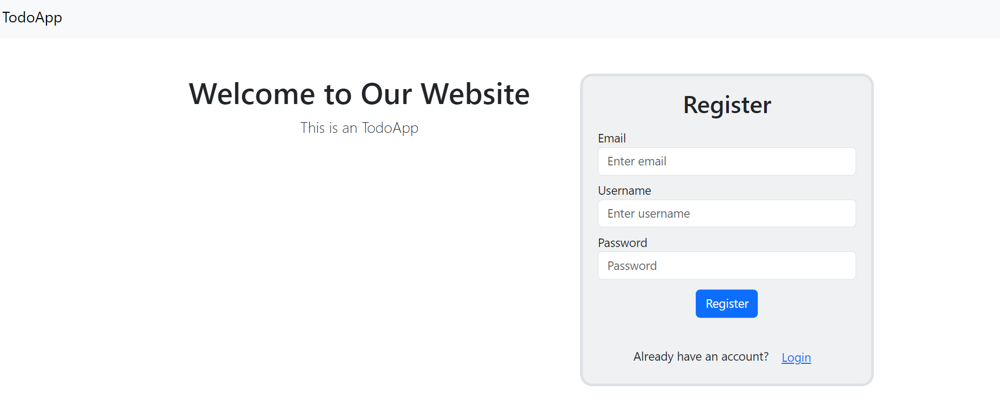
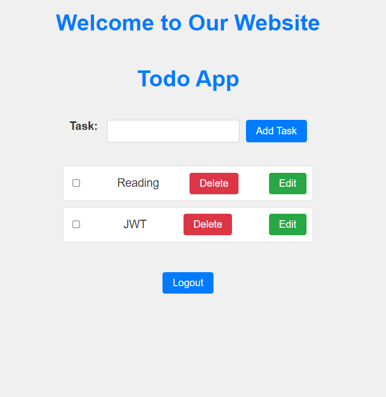

# ToDo App
A Simple web Application for managing your todos . This Project uses Express.js for the backend, MongoDB as the database and javascript for the frontend.
This project uses JWT for authenticating the users using tokens which are stored in cookies.
   - Users can create their accounts and make their todolist
   - Users can perform operations like delete , editing the tasks

## Features

- Create Account by providing respective credentials 
- Add new todos
- view existing todos 
- Mark todos as completed
- Delete todos
- Edit todos

## Technologies used

- **Backend:** Express.js , MongoDB , JWT
- **Frontend:** HTML , CSS , JavaScript

## Screenshot
   - Register page

   - Todos

## Getting Started

### Prerequisites

- Node.js and npm installed
- MongoDB installed and running

### Installation

1. Clone the repository
   
2. Install dependencies
   
       npm install
3. Replace the url with your connection String
   
4. Start the server:

       npm start
5.Open the web browser and go to http://localhost:3000 to access the TodoApp.

## Contributing

Contributions are welcome! Feel free to submit issues or Pull requests.

